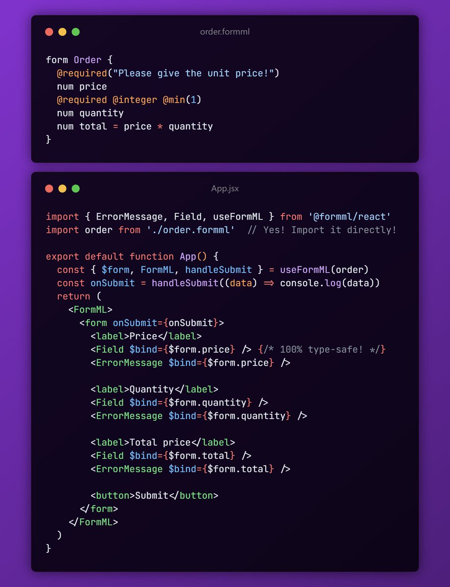

<p align="right"><small>TOC click here ↑</small></p>

<a id="readme-top"></a>

<h1 align="center">
  <br>
  <a href="https://github.com/formml/formml">
    <picture>
      <source srcset="docs/logo/logo-bg.svg" media="(prefers-color-scheme: dark)">
      
    </picture>
  </a>
  <br>
</h1>

<p align="center"><strong>The Ultimate Solution for Building <a href="#whats-the-enterprise-level-forms">Enterprise-Level</a> Forms<br><small>(or at least, I'm aiming for it 😅)</small></strong></p>

<p align="center"><small>- 🚧 In Active Development 🏗️ -</small></p>

<p align="center">  
  <a href="https://www.npmjs.com/package/@formml/client">
    
  </a>
  <a href="https://github.com/formml/formml/blob/main/LICENSE.md">
    
  </a>
  <a href="https://github.com/formml/formml/stargazers">
    
  </a>
  <a href="https://x.com/jindong_z">
    
  </a>
</p>

<p align="center">
  <a href="#motivation">Motivation</a> •
  <a href="#getting-started">Getting Started</a> •
  <a href="#formml-model-reference">FormML Model Reference</a> •
  <a href="#api-reference">API Reference</a> •
  <a href="#known-issues">Known Issues</a> •
  <a href="#roadmap">Roadmap</a> •
  <a href="#faqs">FAQs</a>
</p>

<p align="center">
  <b>Key Features</b>
</p>

<p align="center">
  👨‍👩‍👧‍👦 Non-dev friendly DSL<br>
  🛡️ Next-level type safety<br>
  🚀 Faster than Starship<br>
  🔌 Framework agnostic<br>
  🔄 First-class dynamic forms support (WIP)<br>
  ⚡ First-class real-time forms support (WIP)
</p>

<p align="center">
  
</p>

**FormML** (Form Modeling Language, pronounced as "formal") is a full-stack framework for building **enterprise-level** forms.

It's under active development now and currently provides official **React** bindings.

## Motivation

Forms can be **simple** (a sign-up or a survey) or **complex** (a loan application or a tax return). While there are many powerful tools in the ecosystem for building basic forms, such as [Formik](https://formik.org/) and [React Hook Form](https://react-hook-form.com/), there isn't yet a serious solution (to my knowledge) that specifically addresses the pain points of complex forms - the **Enterprise-Level** forms.

### What's the Enterprise-Level Forms?

Imagine you're a financial company building an online loan application form. What challenges might you face?

- **Non-Tech Stakeholders Driven**: Loans are serious business involving specialized knowledge across finance, accounting, and legal domains - knowledge typically held only by **non-technical experts**. A key challenge is enabling these stakeholders to lead form design while maintaining smooth collaboration with developers.
- **Branded UI & Custom UX**: Developers matter too! Companies don't want cookie-cutter form designs. Every serious enterprise wants to build their brand and deliver unique user experiences, goals that require developer expertise to achieve.
- **Calculations, Formulas & Dynamic Behavior**: Loan amounts, monthly payments and other fields need real-time calculation through formulas. Different fields also need to be shown or hidden based on the selected "loan type".
- **Auto-save & Resume**: Complex forms can have hundreds of fields - users don't want to start over if they accidentally close their browser.
- **Others**: Performance, validation, prefilling, and more.

These aren't niche problems specific to certain scenarios, but common challenges enterprises face when building complex forms. We call all the forms with similar pain points "**Enterprise-Level**" forms.

### How Does FormML Address These?

- **Non-Tech Stakeholders Driven** ➡️ **Non-Dev Friendly DSL**: As its full name "Form Modeling Language" suggests, FormML's core is a DSL for modeling forms. It was designed from the ground up for non-developers, with simple structure, minimal syntax, and more natural terminology (e.g., "text" instead of "string").
- **Branded UI & Custom UX** ➡️ **Model-View Separation**: FormML DSL focuses on modeling form business logic. Once the model (`.fml` file) is complete, UI/view implementation is entirely in developers' hands and fully customizable.
- **Calculations, Formulas & Dynamic Behavior** ➡️ **First-class dynamic forms support** & **Excel-like formula** (WIP)
- **Auto-save & Resume** ➡️ **First-class real-time forms support** (WIP)
- **Others**: Performance (reactivity system based on [@vue/reactivity](https://github.com/vuejs/core/tree/main/packages/reactivity)), validation (annotations based on [valibot](https://valibot.dev/)), prefilling (plugin system)

<p align="right">(<a href="#readme-top">back to top</a>)</p>

## Getting Started

> 💡 You may not need to read everything
>
> - 📝 For non-technical people (FormML Model authors): You only need to understand the [Create Your First FormML Model](#create-your-first-formml-model) section
> - 👨‍💻 For developers: It's recommended to read all

### Create Your First FormML Model

At its core, FormML features a non-developers friendly DSL (Domain-Specific Language) designed to describe form structure, types, and logic. These descriptions are typically written in one (or a set of) `.fml` files. All form definitions within `.fml` files together constitute a _FormML Model_.

Let's create your first FormML Model step by step.

1. Install and open [Visual Studio Code](https://code.visualstudio.com/)
2. Install the FormML extension (VSCode only for now)
3. Create a `sign-up.fml` file anywhere
4. Enter the following content:

```kotlin
form SignUp {
  text     name
  text     email
  text     password
  datetime birthday
}
```

Congratulations! You've just created a simplest FormML Model.

<details>
<summary>Explanation for beginners</summary>

This code demonstrates 2 core syntactic elements of FormML DSL:

- `form SignUp { ... }`: Defines a form named `SignUp`, with its contents enclosed within the `{ ... }` code block
- `text name`: Defines a form field named `name` of type `text`

</details>

In FormML DSL, fields are **optional** by default (since required fields are typically the minority in complex forms).

To make a field required, you can add the `@required` annotation. Let's make `name`, `email`, and `password` required:

```kotlin
form SignUp {
  @required
  text     name
  @required
  text     email
  @required
  text     password
  datetime birthday
}
```

Now these three fields cannot be empty, or users will see error messages.

We can further enhance field validation by adding more annotations or modifying annotation parameters:

```kotlin
form SignUp {
  @required("Let me know your cool name!")
  text     name
  @required @email
  text     email
  @required @minLength(8)
  text     password
  datetime birthday
}
```

<details>
<summary>Explanation for beginners</summary>

Here's what we changed/added:

- `@required("Let me know your cool name!")`: Added a new parameter to `name` field's `@required` annotation, that specifies a custom error message
- `@email`: Added the `@email` annotation to `email` field to validate text format
- `@minLength(8)`: Added the `@minLength` annotation with parameter 8 to `password` field to enforce a minimum length of 8 characters

</details>

Perfect! You now have your first complete FormML Model. For more FormML DSL syntax, please refer to the [FormML DSL Reference](#formml-dsl-reference) section.

### Create UI

Once you have your FormML Model ready (either written by yourself or from non-technical experts), you can start to create your form UI with React now.

> 💡 FormML itself is framework agnostic. But for now only the React bindings is ready.

To import `.fml` files directly into your JS/TS files, you'll need to complete these 2 setups firstly:

<details>
<summary>Set up your bundler</summary>

FormML provides a Vite/Rollup plugin for importing `.fml` files in JavaScript (other bundlers support is coming soon). Here's how to set it up with Vite (Rollup configuration is similar):

1 - Install the plugin

```bash
npm install rollup-plugin-formml --save-dev
```

2 - Edit your `vite.config.ts` file to enable the plugin:

```ts
...
import formml from 'rollup-plugin-formml'

export default defineConfig({
  ...
  plugins: [formml()],
})
```

</details>

<details>
<summary>Set up TypeScript</summary>

To provide real-time type checking (even after editing `.fml` files), FormML uses [TypeScript's Language Service Plugin](https://github.com/microsoft/TypeScript/wiki/Writing-a-Language-Service-Plugin) feature. Here's how to set it up:

> See [Why not code generation?](#why-not-code-generation) to learn the reason of this decision.

> TypeScript Language Service Plugin [only affects your editing experience](https://github.com/microsoft/TypeScript/wiki/Writing-a-Language-Service-Plugin#whats-a-language-service-plugin), meaning FormML Model's type information won't be included when running the `tsc` command.
>
> For more information, see: [Using `tsc` to check FormML Model types](#using-tsc-to-check-formml-model-types).

1 - (For VSCode users) VSCode defaults to using the global TypeScript version which won't load the plugin correctly. Configure VSCode to [use the workspace version of TypeScript](https://code.visualstudio.com/docs/typescript/typescript-compiling#_using-the-workspace-version-of-typescript)

2 - Install the FormML TypeScript plugin

```bash
npm install @formml/ts-plugin --save-dev
```

3 - Edit your `tsconfig.json` file to enable the plugin:

```json
{
  "compilerOptions": {
    "plugins": [{ "name": "@formml/ts-plugin" }]
  }
}
```

4 - Restart TS Server to see type information

</details>

Next, create your first form component with FormML Model.

1 - Install FormML React bindings

```bash
npm install @formml/react --save
```

2 - Create a `SignUpForm.tsx` file then display your first field:

```jsx
import { Field, ErrorMessage, useFormML } from '@formml/react'

// import `.fml` directly and enjoy real-time type checking
import SignUp from './sign-up.fml'

export default function App() {
  const { $form, FormML, handleSubmit } = useFormML(SignUp)

  // "handleSubmit" will validate inputs before invoking real "onSubmit"
  const onSubmit = handleSubmit(data => console.log(data))

  return (
    {/* "FormML" - a context provider */}
    <FormML>
      <form onSubmit={onSubmit}>
        <label>Name</label>

        {/* "Field" - a smart input component that binds to FormML Model field via `$form.name` */}
        <Field $bind={$form.name} />

        {/* "ErrorMessage" - a helper component that displays error message for the field */}
        <ErrorMessage $bind={$form.name} as="span" />

        <button>Submit</button>
      </form>
    </FormML>
  )
}
```

Congratulations! You've just created your first FormML form. Integrate it into your app and run `vite dev` to see the result now!

Learn more details by expanding below sections.

<details>
<summary>Understanding <code>$form.name</code> and <i>field indexes</i>: How do they enable the <strong>next-level</strong> type safety?</summary>

We call `$form.name` above a _field index_. It's a tool for referencing a FormML Model field in JavaScript, and is typically passed as the `$bind` prop to components like `Field` and `ErrorMessage`.

Unlike string-based indexing approaches (used by Formik, React Hook Form, etc.), field indexes are generated from the FormML Model (with real-time type information provided through the TS plugin), enabling truly next-level type safety.

This next-level type safety manifests in three ways:

1 - Type-Based Completion

`$form` is known as the _index root_ - think of it as an index pointing to the entire form, making it the root of all child indexes.

Crucially, it's fully typed, so when you access its children via dot notation, VSCode automatically lists all possible child indexes.

(image)

This feature will also apply to planned _FormML Model composite types_, providing autocompletion when writing nested paths like `$form.parent.child`.

2 - Field-Level Type Checking

`$form.name` has type `TextIndex` because it's defined as `text name` in the FormML Model.

Therefore, if you have a custom `DatePicker` component (introduced in the next section) that only accepts `datetime` fields, `$form.name` cannot be passed to it:

```tsx
function DatePicker(props: { $bind: DatetimeIndex }) {
  ...
}

<DatePicker $bind={$form.name} /> {/* TS Error: "$form.name" is not of type DatetimeIndex */}
```

3 - Enabling Truly **Reusable** Form Components

This is where field indexes truly shine!

Field indexes provide an interface layer that decouples specific form content from generic form components, making components genuinely reusable.

For example, the `DatePicker` component above depends on the `DatetimeIndex` type rather than any specific form, so it can be reused across different scenarios - like `birthday` in a sign-up form, `dueDate` in a todo-list form, etc.

> 🎁 Planned _FormML Model composite types_ will take reusability to new heights:
>
> FormML Models will be able to group related fields into new composite types. Meanwhile generic components can also declare which fields they depend on.
>
> Type compatibility checks are then left entirely to TypeScript.

</details>

<details>
<summary>Creating custom field components with <code>useField</code> hook</summary>

Let's create a custom `DatePicker` component mentioned above using the `useField` hook:

```tsx
function DatePicker(props: { $bind: DatetimeIndex }) {
  const { field, meta } = useField(props.$bind)
  return (
    <>
      <input type="datetime-local" {...field} /> {/* Includes `name`, `value`, `onChange`, `onBlur` */}
      {meta.error && <span>{meta.error.message}</span>}
      {meta.touched && <span>Ta-Da!</span>}
    </>
  )
}
```

> 📝 For more details about `useField` API, please refer to [API Reference](#api-reference).

FormML implements a reactivity system based on [@vue/reactivity](https://github.com/vuejs/core/tree/main/packages/reactivity). When form state updates occur, FormML ensures components only re-render when their specifically watched states change.

</details>

### Server-side Validation

FormML is full-stack - you can use the same FormML Model to validate form submissions on the server side.

> Before starting, make sure you've completed the bundler and TypeScript setup as described in the previous [Create UI](#create-ui) section.

1 - Install `@formml/core`

```bash
npm install @formml/core --save
```

2 - Use the `parse` function to validate and transform data ([Express.js](https://expressjs.com/) example)

```ts
import express from 'express'
import { parse } from '@formml/core'
import SignUp from './sign-up.fml'

const app = express()

app.post('/sign-up', (req, res) => {
  // Assuming form data is submitted as JSON
  // Validate & parse plain object into rich object
  const data = parse(req.body, SignUp)
  res.status(201).end()
})

app.listen(3000, () => {
  console.log('Server is running on port 3000')
})
```

Each primitive type in FormML Model has its corresponding [JavaScript type](#primitive-types). The `parse` function will first validate the data according to the FormML Model definition, then convert plain data to rich types.

```ts
const data = {
  name: 'John',
  email: 'john@example.com',
  password: 'password',
  birthday: '1999-12-31T00:00:00.000Z',
}

const result = parse(data, SignUp) // Converts string => Date
// result is:
// {
//   name: "John",
//   email: "john@example.com",
//   password: "password",
//   birthday: Date("1999-12-31T00:00:00.000Z"),
// }
```

If validation fails, the `parse` function will throw an error.

> 📝 For more information about the `parse` function, please refer to the [API Reference](#api-reference).

> FormML also provides `safeParse` and `validate` functions for different scenarios. See the [API Reference](#api-reference) for details.

<p align="right">(<a href="#readme-top">back to top</a>)</p>

## FormML Model Reference

### Primitive Types

<p align="right">(<a href="#readme-top">back to top</a>)</p>

## API Reference

<p align="right">(<a href="#readme-top">back to top</a>)</p>

## Known Issues

<p align="right">(<a href="#readme-top">back to top</a>)</p>

## Roadmap

<p align="right">(<a href="#readme-top">back to top</a>)</p>

## FAQs

### Why not code generation?

### Using `tsc` to check FormML Model types

<p align="right">(<a href="#readme-top">back to top</a>)</p>
